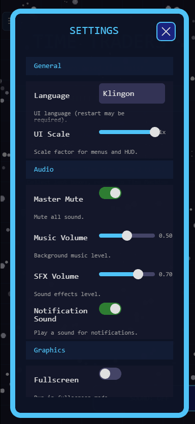

# phaser-settings

Data-driven Phaser 3 settings system: schema, storage adapter, validation, and modal UI (toggle, slider, select, segmented, action, section).

**This package is the single source of truth for settings in consuming apps.** Apps must use only its [public API](PUBLIC_API.md) and must not wrap or duplicate its resolution/validation behavior. See [docs/INTEGRATION.md](docs/INTEGRATION.md) for the client contract and [AGENTS.md](AGENTS.md) for instructions to AI coding agents.



## Install

**From npm** (when published):

```bash
npm install phaser-settings
```

**From GitHub** (this repo). The repo must have at least one commit (e.g. on `main`).

**Tarball (recommended on Windows — no Git/SSH):**

```bash
npm install https://github.com/Unic0rn0ver10ad/Phaser-Settings/archive/refs/heads/main.tar.gz
```

**Or via Git (HTTPS):**

```bash
npm install https://github.com/Unic0rn0ver10ad/Phaser-Settings.git
```

In `package.json` use the same URL (tarball or .git). If you see SSH or Windows dofork errors, use the tarball URL or run `git config --global url."https://github.com/".insteadOf ssh://git@github.com/`. See [docs/INTEGRATION.md](docs/INTEGRATION.md#1-install-from-github).

Then run `npm install`. A postinstall script builds the package so `dist/` exists. If you install with `--omit=dev`, run `npm run build` from the package root (or from `node_modules/phaser-settings`) after install.

**Peer dependency:** `phaser` ^3.60.0.

### Troubleshooting: "Failed to resolve entry for package phaser-settings"

This usually means the package was installed without built output (`dist/` missing). Fix it by:

- **Normal install:** Postinstall runs automatically; if it was skipped or failed, run `npm run build` from this repo root (or `cd node_modules/phaser-settings && npm run build` in your app).
- **Production/CI** (`npm install --omit=dev`): The package’s devDependencies (TypeScript) may not be installed, so postinstall cannot build. Run `npm run build` in the phaser-settings package before starting your dev server, or install without `--omit=dev` for local development.
- **From npm:** Published tarballs include `dist/`; no extra step needed.

## Quick start

1. **Implement a storage adapter** (e.g. bridge to your save system / localStorage):

```ts
import type { SettingsStorageAdapter } from 'phaser-settings';

const adapter: SettingsStorageAdapter = {
  load() {
    return JSON.parse(localStorage.getItem('settings') ?? '{}');
  },
  save(data) {
    localStorage.setItem('settings', JSON.stringify(data));
  },
};
```

2. **Build your schema** (categories + definitions). See types in `phaser-settings` for `SettingsSchema`, `SettingDefinition` (toggle, slider, select, segmented, action, section).

3. **Initialize the manager** once at bootstrap:

```ts
import { SettingsManager } from 'phaser-settings';

SettingsManager.create({ schema: yourSchema, storage: adapter });
```

4. **Register the settings scene** and open it (e.g. from a menu button):

```ts
import { createSettingsModalScene } from 'phaser-settings';

const SettingsScene = createSettingsModalScene({
  manager: SettingsManager.getInstance(),
  onAction: ({ settingId, manager, scene, requestClose }) => {
    // Handle restoreDefaults, deleteSave, credits, etc.
  },
  onClose: (scene) => { /* e.g. play sound */ },
});

// In your Phaser config:
scene: [..., SettingsScene]

// Open modal:
this.scene.launch('SettingsScene');
```

## Verifying the Package

- `npm run check` — TypeScript
- `npm run test` — Vitest (manager unit tests)
- `npm run build` — output in `dist/`

### Local playground (dev only)

A React + Phaser playground in `apps/playground` lets you manually test phaser-settings (including touch controls) in a consumer-like setup. It is **not** included in the published package (`npm run verify:pack` checks this).

- `npm run dev:playground` — build library, install deps, start Vite dev server (one command)
- `npm run build:playground` — build library and playground for production
- `npm run test:playground` — run playground unit tests
- `npm run verify:pack` — assert publish payload excludes `apps/playground` (run before `npm publish`)

## Integrating with your Game

- `npm run check`, `npm run lint`, `npm run build`
- Manual QA:
  - Open settings from every entry point (menu button on run scene, menu background).
  - Change each control type (toggle, slider, select, segmented); confirm value and persistence after reload.
  - Restore defaults; confirm state.
  - Delete save (or equivalent); confirm modal closes and navigation to menu works.
  - ESC and click-outside close the modal; X closes the modal.
  - Narrow viewport: no horizontal clip; labels wrap.

## Lockfile

For local development use `"phaser-settings": "file:./packages/phaser-settings"` in the app; after publishing use the published version. Run `npm install` after changing the package.

## How to add a new setting

1. Add a definition to your schema (e.g. in `settingsDefinitions.ts`). Append to the definitions array; add a category if needed.
2. Read the value in game code via `SettingsManager.getInstance().get('id')` or `.getOrDefault('id')`.
3. Optional: register an apply callback with `settings.onApplySetting('id', (id, value) => { ... })` for immediate effects.

- **Integration guide** (install, adapter, schema, bootstrap, scene registration): [docs/INTEGRATION.md](docs/INTEGRATION.md)
- **API and contract**: [docs/API.md](docs/API.md) (lifecycle, storage, migrations, scene options).

## API

- **Types**: `SettingValue`, `SettingDefinition`, `SettingsSchema`, `SettingsTheme`, etc.
- **Storage**: `SettingsStorageAdapter` interface.
- **Manager**: `SettingsManager.create()`, `getInstance()`, `resetForTests()`, `isInitialized()`; instance methods `get`, `set`, `resetToDefaults`, `subscribe`, `onApplySetting`, etc.
- **UI**: `defaultSettingsTheme`, `renderSettingsList()`, `createSettingsModalScene()`.

Public export list and stability: see [PUBLIC_API.md](PUBLIC_API.md).

## Publish checklist

Before `npm publish`, run `npm run verify:pack`. It runs `npm pack --dry-run` and fails if any `apps/playground` files appear in the tarball. The package already uses `files` allowlisting (`dist`, `README.md`, `docs`), so the playground is excluded by default; this script is an extra guardrail.

## Versioning

0.x — pre-1.0; API may change. 1.0+ follows SemVer.
